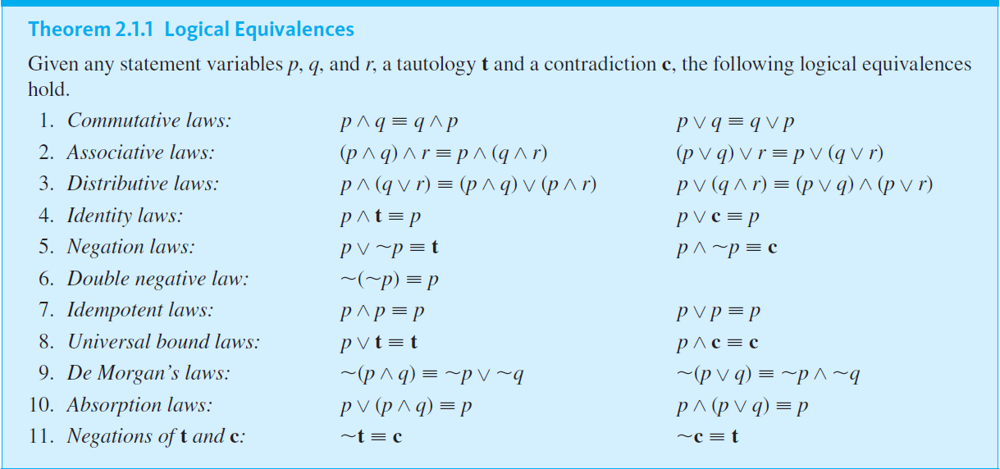

# Logical Equivalence

---

## Logically Equivalent Statements
Two statements are called logically equivalent if, and only if, they have logically
equivalent forms when identical component statement variables are used to
replace identical component statements.

## Logically Equivalent Statement Forms
Two statement forms are called logically equivalent if, and only if, they have identical
truth values for each possible substitution of statements for their statement
variables. The logical equivalence of statement forms $P$ and $Q$ is denoted by writing $P \equiv Q$.

## Testing Whether Two Statement Forms P and Q Are Logically Equivalent
1. Construct a truth table with one column for the truth values of P and another column for the truth values of Q.
2. Check each combination of truth values of the statement variables to see whether the truth value of P is the same as the truth value of Q.
   1. If in each row the truth value of P is the same as the truth value of Q, then P and Q are logically equivalent.
   2. If in some row P has a different truth value from Q, then P and Q are not logically equivalent.

---

## Fundamental Logical Connectives

Summary of most used logical connectives by priority 

| **Name**      | **Known As**       | **Language**                               | **Symbol**                |
|---------------|--------------------|--------------------------------------------|---------------------------|
| Negation      | NOT                | "is **not** the case that p", " **not** p" | $\urcorner p$ or $\sim p$ |                                                 
| Conjunction   | AND                | "p **but** q", "p **and** q"               | $p \wedge q$              |                                                
| Disjunction   | OR (Inclusive)     | "p **or** q"                               | $p \vee q$                |                                                 

### NOT
If $p$ is a statement variable, the negation of $p$ is **“not p”** or “It is not the case that $p$”
and is denoted $\urcorner p$. It has opposite truth value from $p$: if $p$ is true, $\urcorner p$ is false; if $p$ is
false, $\urcorner p$ is true.

| $p$ | $\sim p$ |
|-----|----------|
| T   | **F**    |
| F   | **T**    |

### AND
If $p$ and $q$ are statement variables, the conjunction of $p$ and $q$ is **“p and q”** denoted 
$p \wedge q$. It is true when, and only when, both $p$ and $q$ are true. If either $p$ or $q$ is false, 
or if both are false, $p \wedge q$ is false.

| $p$ | $q$ | $p \wedge q$ |
|-----|-----|--------------|
| T   | T   | **T**        |
| T   | F   | **F**        |
| F   | T   | **F**        |
| F   | F   | **F**        |

### OR (Inclusive OR)
If $p$ and $q$ are statement variables, the disjunction of $p$ and $q$ is **“p or q”** denoted
$p \vee q$. It is true when either $p$ is true, or $q$ is true, or both $p$ and $q$ are true; it is false
only when both $p$ and $q$ are false.

| $p$ | $q$ | $p \vee q$ |
|-----|-----|------------|
| T   | T   | **T**      |
| T   | F   | **T**      |
| F   | T   | **T**      |
| F   | F   | **F**      |

From these basic "building blocks" we can create new logical connectives (such as XOR, Implication, Double Implication, ...) and even
create Compound statements and Compound statement forms.

 

#### XOR (Exclusive OR) - Extra
Note that when or is used in its exclusive sense, the statement “p or q” means “p or q but not both” or “p or q and
not both p and q,” which translates into symbols as $(p \vee q) \wedge \sim (p \wedge q)$

Then we can use $p XOR q$, $p \bigoplus q$, $(p \vee q) \wedge \sim (p \wedge q)$ equivalently

| $p$ | $q$ | $p \vee q$ | $p \wedge q$ | $\sim (p \wedge q)$ | $(p \vee q) \wedge \sim (p \wedge q)$ |
|-----|-----|------------|--------------|---------------------|---------------------------------------|
| T   | T   | T          | T            | F                   | **F**                                 |
| T   | F   | T          | F            | T                   | **T**                                 |
| F   | T   | T          | F            | T                   | **T**                                 |
| F   | F   | F          | F            | T                   | **F**                                 |

---

 

## Summary of Logical Equivalences

Table for Theorem 2.1.1

---

#### References
* [Epp, Susanna](https://condor.depaul.edu/~sepp/). [ETextbook: Discrete Mathematics With Applications, Metric Edition. Fifth Edition](https://condor.depaul.edu/~sepp/DM5e.htm), USA, © 2020, 2011, 2004 Cengage Learning, Inc., 2020.
  * Chapter 2: The Logic of Compound Statements 
    * Section 2.1: Logical Form and Logical Equivalence

