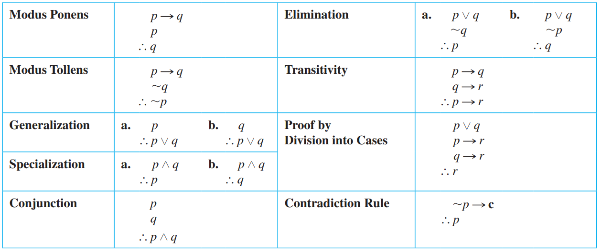

# Arguments and their Validity
In mathematics and logic an argument is not a dispute. It is simply a **sequence of statements ending in a conclusion**. In this section we show how to determine whether an argument is valid—that is, whether the conclusion follows necessarily from the preceding
statements

Table of Contents - Arguments

```text
Arguments
	Arguments and Argument Forms - Definition
	Validity of Arguments - Definition
	Infer Validity of Arguments - Truth Tables
	Rules of Inference
		Syllogism
			Modus Ponens (or Deduction)
			Modus Tollens
		Generalization
		Specialization
		Elimination
		Transitivity 
		Division into cases
	Fallacies - Definition 
		Convers Error
		Inverse Error

```

---

<br>

## Arguments and Argument Forms 
> An argument is a sequence of statements, and an argument form is a sequence
> of statement forms. 

We can divide them in two parts
* All statements in an argument and all statement forms in an argument form, except for the final one, are called **premises** (or assumptions or hypotheses)
* The final statement or statement form is called the **conclusion**. 
  * The symbol $\therefore$, which is read “therefore,” is normally placed just before the conclusion.

```math
\begin{align*}
  \text{if } p \text{ then } q \\
  p \\ 
  \therefore q
\end{align*}
```
When considering the abstract form of an argument, think of $p$ and $q$ as variables for
which statements may be substituted. 

An argument form is called **valid if, and only if,** whenever statements are substituted that make 
**all the premises true**, **the conclusion is also true**.

<br>

## Valid Arguments and Valid Argument Forms 
> To say that an argument form is valid means that no matter what particular
> statements are substituted for the statement variables in its premises, if the resulting
> premises are all true, then the conclusion is also true. To say that an argument is
> valid means that its form is valid

It is impossible to have a valid argument with all true premises and a false conclusion. When an
argument is valid and its premises are true, the truth of the conclusion is said to be inferred
or deduced from the truth of the premises.

## Testing an Argument for Validity - Truth Tables
1. Identify the premises and conclusion of the argument form.
2. Construct a truth table showing the truth values of all the premises and the conclusion.
   1. When you fill in the table, you only need to indicate the truth values for the conclusion in the rows where all 
   the premises are true (the critical rows) because the truth values of the conclusion in the other rows are
   irrelevant to the validity or invalidity of the argument.
1. A row of the truth table in which all the premises are true is called a critical row. 
   1. If there is a critical row in which the conclusion is false, then it is possible for an argument of the given form to have true premises 	and a false conclusion, and so the argument form is invalid. 
   2. If the conclusion in **every critical row is true**, then the argument form is valid.

Attention: If at least one premise of an argument is false, then we have no information about the 
conclusion: It might be true or it might be false!

--- 

<br>

## Rules of Inference  
> A rule of inference is a form of argument that is valid

Valid Argument Forms:



## 1 - Syllogisms
> An argument form consisting of two premises and a conclusion is called a syllogism.
> The first and second premises are called the **major premise** and **minor premise**, respectively.

Two types of syllogism that are widely used are: Modus Ponens and Modus Tollens.

### 1.1 - Deduction or Modus Ponens 
The term modus ponens is Latin meaning *method of affirming* (the conclusion is an affirmation)

It is a type of syllogism which implies reasoning of the form "if $p$ is true and $p \Rightarrow q$ is true, then $q$ is true"

```math
\begin{align*}
  \text{if } p \text{ then } q \\
  p \\ 
  \therefore q
\end{align*}
```

### 1.2 - Modus Tollens 
The term modus ponens is Latin meaning *method of denying* (the conclusion is a denial)

It is a type of syllogism which implies reasoning of the form "if $p$ is true and $p \Rightarrow q$ is true, then $q$ is true"

```math
\begin{align*}
  \text{if } p \text{ then } q \\
  \sim q \\ 
  \therefore \text{ } \sim p
\end{align*}
```

The validity of modus tollens can be shown to follow from modus ponens together with the fact that a conditional statement is logically equivalent to its contrapositive.


### 2 - Generalization
These argument forms are used for making generalizations. For instance, according to
the first, if p is true, then, more generally, “p or q” is true for any other statement q.

```math
\begin{align*}
  p \\ 
  \therefore p \vee q
\end{align*}
```

```math
\begin{align*}
  q \\ 
  \therefore p \vee q
\end{align*}
```

#### Genaralization Example
As an example, suppose you are given the job of counting the upperclassmen at your school. You
ask what class Anton is in and are told he is a junior. You reason as follows: Knowing that upperclassman 
means junior or senior, you add Anton to your list. 

```math
\begin{align*}
	\text{Anton is a junior} \\ 
	\therefore \text{ (more generally) Anton is a junior or Anton is a senior}
\end{align*}
```


### 3 - Specialization
These argument forms are used for specializing. When classifying objects according to
some property, you often know much more about them than whether they do or do not have
that property. When this happens, you discard extraneous information as you concentrate
on the particular property of interest.

```math
\begin{align*}
  p \wedge q \\ 
  \therefore p 
\end{align*}
```

```math
\begin{align*}
  p \wedge q \\ 
  \therefore q
\end{align*}
```

#### Specialization Example
For instance, suppose you are looking for a person who knows graph algorithms to work
with you on a project. You discover that Ana knows both numerical analysis and graph
algorithms. You reason as follows: Accordingly, you invite her to work with you on your project.

```math
\begin{align*}
	\text{Ana knows numerical analysis and Ana knows graph algorithms} \\ 
	\therefore \text{ (in particular) Ana knows graph algorithms}
\end{align*}
```

### 4 - Elimination
These argument forms say that when you have only two possibilities and you can rule
one out, the other must be the case.

```math
\begin{align*}
  p \vee q \\ 
  \sim q \\
  \therefore p
\end{align*}
```

```math
\begin{align*}
  p \vee q \\ 
  \sim p \\
  \therefore q
\end{align*}
```


### 5 - Transitivity 
Many arguments in mathematics contain chains of if-then statements to provide proof/demonstration for theorems. 

From the fact that one statement implies a second and the second implies a third, you can conclude that the
first statement implies the third (and so on).

In fact, it is very common to face something like: 
```math
\begin{align*}
	p_{0} \Rightarrow p_{1} \Rightarrow p_{2} \Rightarrow \ldots \Rightarrow p_{n}
\end{align*}
```

where $p_{0}$ is usually called "postulate" or "axiom", which is argument that is considered true although no 
demonstration has been provided.

### 6 -  Proof by Division into Cases
It often happens that you know one thing or another is true. If you can show that in either case
a certain conclusion follows, then this conclusion must also be true.

This means, sometimes you must take all the possible cases and demonstrate them separately.

---

<br>

## Fallacies
> A fallacy is an error in reasoning that results in an invalid argument.

Three common fallacies are:
1. **Using Ambiguous Premises**, and treating them as if they were unambiguous;
2. **Circular Reasoning**, assuming what is to be proved without having derived it from the premises; 
3. And **Jumping to a conclusion** (without adequate grounds).

In this section we discuss two other fallacies, **called converse error and inverse error**, which give rise to
arguments that superficially resemble those that are valid by modus ponens and modus tollens but are not, in fact, valid.

As in previous examples, you can show that an argument is invalid by: 
1. Constructing a truth table for the argument form and finding at least one critical row in which all the premises are true but the conclusion is false. 
2. Another way is to find an argument of **the same form with true premises and a false conclusion**.

> For an argument to be valid, every argument of the same form whose premises are all true must have a true conclusion. 
> It follows that for an argument to be invalid means that there is an argument of that form whose premises are all 
> true and whose conclusion is false.


### Converse Error
The fallacy underlying this invalid argument form is called the converse error because
the conclusion of the argument would follow from the premises if the premise $p \Rightarrow q$ were
replaced by its converse. 

Such a replacement is not allowed, however, because a conditional statement is not logically equivalent 
to its converse. Converse error is also known as the *fallacy of affirming the consequent*.

```math
\begin{align*}
  p \Rightarrow q \\ 
  q \\
  \therefore p 
\end{align*}
```

#### Converse Error Example
	
```math
\begin{align*}
	\text{ If Zeke is a cheater, then Zeke sits in the back row. } \\ 
	\text{ Zeke sits in the back row. } \\
	\therefore \text{ Zeke is a cheater.}
\end{align*}
```

The first premise gives information about Zeke if it is known
he is a cheater. It doesn’t give any information about him if it is not already known that he
is a cheater. One can certainly imagine a person who is not a cheater but happens to sit in
the back row. Then if that person’s name is substituted for Zeke, the first premise is true by
default and the second premise is also true but the conclusion is false


### Inverse Error


```math
\begin{align*}
  p \Rightarrow q \\ 
  \sim q \\
  \therefore \text{ } \sim p 
\end{align*}
```

#### Inverse Error Example
