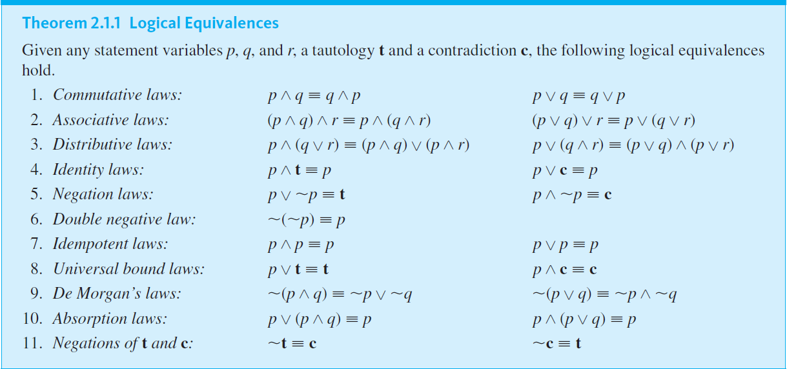

# Cheatsheet

## Logical Connectives

| **Name**      | **Known As**       | **Language**                               | **Symbol**                | **Logically Equivalent to**                     |
|---------------|--------------------|--------------------------------------------|---------------------------|-------------------------------------------------|
| Negation      | NOT                | "is **not** the case that p", " **not** p" | $\urcorner p$ or $\sim p$ |                                                 |
| Conjunction   | AND                | "p **but** q", "p **and** q"               | $p \wedge q$              |                                                 |
| Disjunction   | OR (Inclusive)     | "p **or** q"                               | $p \vee q$                |                                                 |
| Conditional   | IMPLICATION        | " **if** p **then** q"                     | $p \Rightarrow q$         | $(\sim p) \vee q$ and $(\sim q ) \Rightarrow p$ |
| Biconditional | DOUBLE IMPLICATION | "p **if and only if** q"                   | $p \Longleftrightarrow q$ | $(p \Rightarrow q) \wedge (q \Rightarrow p)$    |

## Logical Equivalences

##